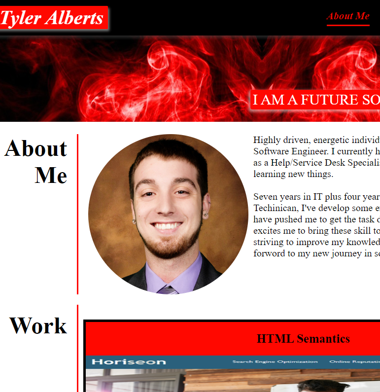

<strong>Tyler Alberts Protfolio</strong>

Welcome to my portfolio! Goal for the portfolio was for it to be built from scratch and using HTML and CSS to sytle the webpage. Targets to aim for with this portfolio was to provide a picture, links on page working correctly by launch to the corresponding web pages on the portfolio. Ensure that the portfolio can open on all devices/adapts to viewports. 

This project was a wild one and one I can not wait to update and make this portfolio 10x better the more I learn aboout coding. I ran into a lot of roadblocks but I did not give up the  theroy crafting with my code and also debugging with Chrome. Throwing everything I have learned in just the 8 days of the bootcamp, I felt great finishing this one and making myself familiar with how to debug and getting the wake up call on the recommended approach when it comes to coding. Note to self and others: Start with the mobile viewpoint when you create your page!! 

You can access my portilo here!

https://tcarocci.github.io/Portfolio/

You can access my github repo below and regarding any issues with my Portfolio please feel free to let me know! 

https://github.com/tcarocci/Portfolio

Here is a little sample of what the page should look like! 

